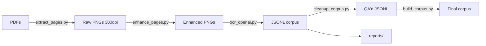

# ARCHITECTURE.md — OCR Pipeline

## Overview

A multi-stage pipeline for extracting bilingual Breton-French parallel text from scanned historical books (circa 1860s–1900s).

## Data Flow



## Project Structure

```
OCR_pipeline/
├── pipeline.py              ← Unified CLI entry point
├── setup.sh                 ← One-command env setup
├── requirements.txt
├── scripts/
│   ├── __init__.py
│   ├── utils.py             ← Shared helpers (types, parsing, target discovery)
│   ├── extract_pages.py     ← PDF → PNG
│   ├── enhance_pages.py     ← Image enhancement (CLAHE + DocRes)
│   ├── ocr_openai.py        ← VLM-based OCR extraction
│   ├── cleanup_corpus.py    ← JSONL quality assurance (stub)
│   └── build_corpus.py      ← Final corpus merge (stub)
├── prompts/
│   ├── extract_bilingual_corpus.md   ← Base system prompt
│   ├── bozec_methode_1933.md         ← Book-specific overrides
│   ├── colloque_1890.md
│   ├── colloque_lourec_1884.md
│   ├── daniel_ker_vreiz_1944.md
│   ├── geriadur_lexique_1927.md
│   ├── normant_lexique_1902.md
│   ├── roparz_cours_elementaire_1930.md
│   ├── toullec_lexique_1865.md
│   └── yez_hon_tadou_1940.md
├── pdfs/                    ← Source PDFs
├── pages/                   ← Extracted PNGs (per book)
├── pages_enhanced/          ← DocRes-enhanced PNGs
├── corpus/                  ← JSONL output (per book, per model)
│   └── <book>/
│       └── <model>/         ← e.g. gpt-5.2/
├── reports/                 ← Auto-generated quality reports
│   └── <book>/
│       └── <model>/report.md
├── docres/                  ← Cloned DocRes repo + weights
├── AGENTS.md
└── ARCHITECTURE.md
```

## Stage Details

### 1. Page Extraction (`scripts/extract_pages.py`)

- Uses PyMuPDF to render each page at 300 DPI
- Output: `pages/<pdf_stem>/NN.png` (2480×3509 px typical)
- Handles multiple PDFs, auto-discovers from `pdfs/`

### 2. Enhancement (`scripts/enhance_pages.py`)

Current pipeline (in order):
1. **(Optional) DocRes AI** — Restormer-based document restoration (appearance/deblurring/deshadowing)
2. **Grayscale** conversion
3. **CLAHE** — Contrast Limited Adaptive Histogram Equalization (clip_limit=1.5)
4. (Optional) Bilateral denoising
5. (Optional) Adaptive Gaussian binarization + morphological cleanup
6. (Optional) 2× Lanczos upscale

DocRes integration:
- Model: Restormer (~26M params), weights from HuggingFace
- Tasks: `appearance` (background normalization), `deblurring` (Sobel prompt), `deshadowing` (illumination prompt)
- GPU: auto-detects CUDA, runs on RTX 5070 Ti (~2-4GB VRAM per image)

### 3. OCR Extraction (`scripts/ocr_openai.py`)

- Sends each page image to the configured model (default: `gpt-5.2`, override with `--model`)
- Extracts breton/français pairs as JSONL
- Default output: `corpus/<book>/<model>/` (override with `-o`/`--output`)
- Auto-generates quality report in `reports/<book>/<model>/report.md`
- Resumable (skips existing .jsonl files)

### 4. Cleanup (`scripts/cleanup_corpus.py`) — Stub

Quality assurance on extracted JSONL. Not yet implemented.

### 5. Corpus Build (`scripts/build_corpus.py`) — Stub

Merge per-page JSONL into final unified corpus. Not yet implemented.

## Quality Metrics (Baseline)

From `rapport.md` on first book (75 usable pages):
- **OK**: 6 pages (8%)
- **Difficultés**: 61 pages (81%)
- **Impossible**: 8 pages (11%)
- **Average confidence**: 70%

## Improvement Roadmap

| Priority | Technique | Expected Impact | Status |
|----------|-----------|----------------|--------|
| 1 | **DocRes appearance** — AI restoration | High | ✅ Integrated |
| 2 | **Smart tiling** — crop halves before OCR | High (2× resolution) | ⏳ Planned |
| 3 | **Prompt refinement** — `[UNCLEAR]` tokens | Medium | ⏳ Planned |
| 4 | **Page classification** — skip non-bilingual | Medium | ⏳ Planned |
| 5 | **Multi-model ensemble** — multiple DocRes tasks | Medium | ⏳ Planned |
