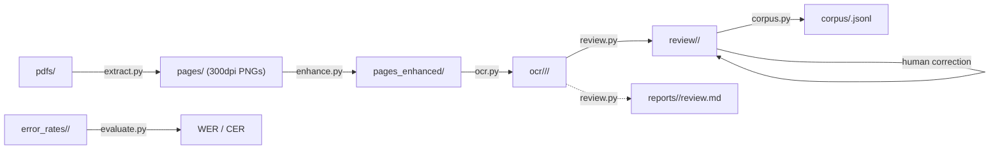

# ARCHITECTURE.md — OCR Pipeline

## Overview

A multi-stage pipeline for extracting bilingual Breton-French parallel text from scanned historical books (circa 1860s–1900s).

## Data Flow



## Project Structure

```
OCR_pipeline/
├── pipeline.py              ← Unified CLI entry point
├── setup.sh                 ← One-command env setup
├── requirements.txt
├── requirements-enhance.txt
├── scripts/
│   ├── __init__.py
│   ├── utils.py             ← Shared helpers (types, parsing, target discovery)
│   ├── extract.py           ← PDF → PNG
│   ├── enhance.py           ← Image enhancement (DocRes + PreP-OCR + CLAHE)
│   ├── ocr.py               ← VLM-based OCR extraction
│   ├── review.py            ← JSONL quality assurance
│   ├── evaluate.py          ← WER/CER evaluation against human reference
│   └── corpus.py            ← Final corpus merge (stub)
├── prompts/
│   ├── extract_bilingual_corpus.md   ← Base system prompt
│   ├── bozec_methode_1933.md         ← Book-specific overrides
│   ├── colloque_1890.md
│   ├── colloque_lourec_1884.md
│   ├── daniel_ker_vreiz_1944.md
│   ├── geriadur_lexique_1927.md
│   ├── normant_lexique_1902.md
│   ├── roparz_cours_elementaire_1930.md
│   ├── toullec_lexique_1865.md
│   └── yez_hon_tadou_1940.md
├── pdfs/                    ← Source PDFs
├── pages/                   ← Extracted PNGs (per book)
├── pages_enhanced/          ← DocRes-enhanced PNGs
├── ocr/                     ← JSONL output (per book, per model)
│   └── <book>/
│       └── <model>/         ← e.g. gpt-5.2/
├── reports/                 ← Auto-generated quality reports
│   └── <book>/
│       └── <model>/report.md
├── docres/                  ← Cloned DocRes repo + weights
├── resshift/                ← Cloned ResShift repo + weights (PreP-OCR)
├── compare/                 ← Enhancement comparison outputs
├── droplist/                ← Per-book page exclusion lists
│   └── <book>/
│       └── drop_pages.json  ← JSON array of page numbers to skip
├── AGENTS.md
└── ARCHITECTURE.md
```

## Stage Details

### 1. Page Extraction (`scripts/extract.py`)

- Uses PyMuPDF to render each page at 300 DPI
- Output: `pages/<pdf_stem>/NN.png` (2480×3509 px typical)
- Handles multiple PDFs, auto-discovers from `pdfs/`

### 2. Enhancement (`scripts/enhance.py`)

**Default: no-op** — pages are copied from `pages/` to `pages_enhanced/` unchanged.

All enhancements are opt-in flags (in processing order):
1. **DocRes AI** — Restormer-based document restoration (deshadowing → deblurring → appearance) (`--docres`; requires `./setup.sh --with-enhance`)
2. **PreP-OCR** — ResShift diffusion deblurring, 256×256 tiles, 4-step diffusion (`--prepocr`; requires `./setup.sh --with-enhance`)
3. **Classical** — Grayscale conversion + CLAHE (clip_limit=1.5) (`--classical`)
4. Bilateral denoising (`--denoise`)
5. Adaptive Gaussian binarization + morphological cleanup (`--binarize`)
6. 2× Lanczos upscale (`--upscale`)

DocRes integration:
- Model: Restormer (~26M params), weights from HuggingFace
- Tasks: `deshadowing` (illumination prompt), `deblurring` (Sobel prompt), `appearance` (background normalization)
- GPU: auto-detects CUDA

PreP-OCR integration:
- Model: ResShift (diffusion-based), weights from HuggingFace
- Tiled inference: 256×256 patches with 4-step diffusion sampling
- Includes VQ-VAE autoencoder for latent-space processing
- GPU required

Comparison tool (`pipeline.py compare`):
- Generates all 18 permutations of DocRes/PreP-OCR/Classical for a single page
- Output: `compare/<book>/<page>/` with 19 images (original + 18 variants)

### 3. OCR Extraction (`scripts/ocr.py`)

- Sends each page image to the configured model (default: `gpt-5.2`, override with `--model`)
- Extracts breton/français pairs as JSONL
- Default output: `ocr/<book>/<model>/` (override with `-o`/`--output`)
- Auto-generates quality report in `reports/<book>/<model>/report.md`
- Resumable (skips existing .jsonl files)

### 4. Review (`scripts/review.py`)

Copies JSONL files from `ocr/<book>/<model>/` to `review/<book>/` (flat, no model subfolder), then runs quality assurance checks. Prompts for confirmation (`y/N`) before erasing existing content in `review/<book>/`. Use `--yes` to skip prompts. Reports go to `reports/<book>/review.md`.

### 5. Evaluate (`scripts/evaluate.py`)

Computes WER and CER against manually corrected human references in `error_rates/<book>/human_reference/`. Reports metrics per page, per language (Breton and French).

### 6. Corpus Build (`scripts/corpus.py`)

Reads per-page JSONL from `review/<book>/` (after human correction), deduplicates exact `{breton, français}` pairs, and writes a single `corpus/<book>.jsonl` per book.

## Quality Metrics (Baseline)

From `rapport.md` on first book (75 usable pages):
- **OK**: 6 pages (8%)
- **Difficultés**: 61 pages (81%)
- **Impossible**: 8 pages (11%)
- **Average confidence**: 70%

## Improvement Roadmap

| Priority | Technique | Expected Impact | Status |
|----------|-----------|----------------|--------|
| 1 | **DocRes appearance** — AI restoration | High | ✅ Integrated |
| 2 | **Smart tiling** — crop halves before OCR | High (2× resolution) | ⏳ Planned |
| 3 | **Prompt refinement** — `[UNCLEAR]` tokens | Medium | ⏳ Planned |
| 4 | **Page classification** — skip non-bilingual | Medium | ⏳ Planned |
| 5 | **Multi-model ensemble** — multiple DocRes tasks | Medium | ⏳ Planned |
