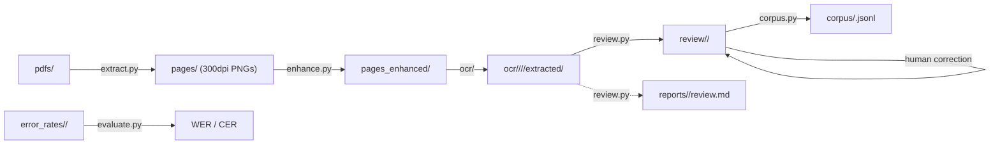

# ARCHITECTURE.md — OCR Pipeline

## Overview

A multi-stage pipeline for extracting bilingual Breton-French parallel text from scanned historical books (circa 1860s–1900s).

## Data Flow



## Project Structure

```
OCR_pipeline/
├── pipeline.py              ← Unified CLI entry point
├── setup.sh                 ← One-command env setup
├── requirements.txt
├── requirements-enhance.txt
├── src/
│   ├── __init__.py
│   ├── utils.py             ← Shared helpers (types, parsing, target discovery)
│   ├── extract.py           ← PDF → PNG
│   ├── enhance.py           ← Image enhancement (DocRes + PreP-OCR + CLAHE)
│   ├── ocr/                 ← VLM-based OCR extraction (package)
│   │   ├── __init__.py      ← Unified CLI (--batch flag routes to batch)
│   │   ├── core.py          ← Shared infra + run-folder management
│   │   ├── providers.py     ← VLM client creation, retry logic, API call wrappers
│   │   ├── reports.py       ← Report template, load/write helpers
│   │   ├── sync.py          ← Page-by-page VLM processing
│   │   └── batch.py         ← Gemini Batch API (async, 50% cost)
│   ├── review.py            ← JSONL quality assurance
│   ├── evaluate.py          ← WER/CER evaluation against human reference
│   └── corpus.py            ← Final corpus merge (stub)
├── prompts/
│   ├── extract_bilingual_corpus.md   ← Base system prompt
│   └── <book>.md                     ← Book-specific overrides
├── pdfs/                    ← Source PDFs
├── pages/                   ← Extracted PNGs (per book)
├── pages_enhanced/          ← DocRes-enhanced PNGs
├── ocr/                     ← OCR output (unified run-folder structure)
│   └── <book>/
│       └── <model>/
│           └── <NNNN>-<YYYYMMDD>-<HHMM>/  ← Run folder
│               ├── prompt.md
│               ├── run_state.json
│               ├── extracted/*.jsonl
│               └── reports/extraction/
│                   ├── XX.md        ← Per-page report
│                   └── report.md    ← Summary report
├── reports/                 ← Review-stage reports
│   └── <book>/review.md
├── docres/                  ← Cloned DocRes repo + weights
├── resshift/                ← Cloned ResShift repo + weights (PreP-OCR)
├── compare/                 ← Enhancement comparison outputs
├── droplist/                ← Per-book page exclusion lists
│   └── <book>/
│       └── drop_pages.json  ← JSON array of page numbers to skip
├── AGENTS.md
└── ARCHITECTURE.md
```

## Stage Details

### 1. Page Extraction (`src/extract.py`)

- Uses PyMuPDF to render each page at 300 DPI
- Output: `pages/<pdf_stem>/NN.png` (2480×3509 px typical)
- Handles multiple PDFs, auto-discovers from `pdfs/`

### 2. Enhancement (`src/enhance.py`)

**Default: no-op** — pages are copied from `pages/` to `pages_enhanced/` unchanged.

All enhancements are opt-in flags (in processing order):
1. **DocRes AI** — Restormer-based document restoration (deshadowing → deblurring → appearance) (`--docres`; requires `./setup.sh --with-enhance`)
2. **PreP-OCR** — ResShift diffusion deblurring, 256×256 tiles, 4-step diffusion (`--prepocr`; requires `./setup.sh --with-enhance`)
3. **Classical** — Grayscale conversion + CLAHE (clip_limit=1.5) (`--classical`)
4. Bilateral denoising (`--denoise`)
5. Adaptive Gaussian binarization + morphological cleanup (`--binarize`)
6. 2× Lanczos upscale (`--upscale`)

DocRes integration:
- Model: Restormer (~26M params), weights from HuggingFace
- Tasks: `deshadowing` (illumination prompt), `deblurring` (Sobel prompt), `appearance` (background normalization)
- GPU: auto-detects CUDA

PreP-OCR integration:
- Model: ResShift (diffusion-based), weights from HuggingFace
- Tiled inference: 256×256 patches with 4-step diffusion sampling
- Includes VQ-VAE autoencoder for latent-space processing
- GPU required

Comparison tool (`pipeline.py compare`):
- Generates all 18 permutations of DocRes/PreP-OCR/Classical for a single page
- Output: `compare/<book>/<page>/` with 19 images (original + 18 variants)

### 3. OCR Extraction (`src/ocr/`)

The OCR step is a Python package with four modules:

- **`__init__.py`** — unified `main()` entry point; `--batch` flag routes to batch mode
- **`core.py`** — shared infra: constants, TypedDicts, cost estimation, `parse_vlm_response()`, run-folder management (prompt hashing, folder discovery/creation, state I/O)
- **`providers.py`** — VLM client creation (`create_client()`), retry with backoff (`_retry_api_call()`), provider-specific API wrappers (`_call_openai`, `_call_anthropic`, `_call_google`), and unified `process_single_image()` entry point
- **`reports.py`** — report template, `load_rapport()`, `write_rapport()`, `write_page_report()`
- **`sync.py`** — synchronous page-by-page processing via `process_book_ocr()`
- **`batch.py`** — Gemini Batch API: submit, poll, collect

**Sync mode** (default):
- Sends each page image to the configured model (default: `gemini-3.1-pro-preview`, override with `--model`)
- Supports OpenAI, Anthropic Claude, and Google Gemini models
- Extracts breton/français pairs as JSONL
- **Run-folder output**: `ocr/<book>/<model>/<NNNN>-<YYYYMMDD>-<HHMM>/` with `prompt.md`, `run_state.json`, `extracted/*.jsonl`, and `reports/extraction/`
- **Prompt-hash reuse**: if the full prompt (system + global + book) hasn't changed, reuses the existing run folder and resumes processing. A prompt change creates a new run folder with incremented counter.
- **Prompt overrides**: `--main-prompt` and `--book-prompt` CLI flags allow testing alternative prompts. The hash is computed from whichever prompts are used, so overrides get separate run folders automatically.
- Override output with `-o`/`--output` (bypasses run-folder structure)
- `parse_vlm_response()` — shared response parser for `=== JSONL ===` / `=== RAPPORT ===` blocks

**Thinking level** (`--thinking`):
- Controls Gemini reasoning depth via `ThinkingConfig`: `default` (model decides), `off`, `minimal`, `low`, `medium`, `high`
- Non-default values append `-think-<level>` to the model directory name (e.g., `gemini-3.1-pro-preview-think-high/`)
- Included in the prompt hash → different thinking levels get separate run folders
- Stored in `run_state.json` alongside temperature
- Silently ignored for non-Gemini providers (with a stderr warning)
- `model_dir_name()` helper in `core.py` builds the directory name

**Batch mode** (`--batch`):
Asynchronous alternative using the **Gemini Batch API** at **50% cost**.

1. **Submit** (`pipeline.py ocr <book> --batch`) — uploads page images via File API (with dedup), creates batch job, saves state
2. **Status** (`pipeline.py batch_status <book>`) — polls job state (PENDING → RUNNING → SUCCEEDED)
3. **Collect** (`pipeline.py batch_status <book> --wait`) — retrieves results, writes per-page `.jsonl` + report

**Output**: uses the same unified run-folder structure:
```
ocr/<book>/<model>/<NNNN>-<YYYYMMDD>-<HHMM>/
  ├── prompt.md          ← full prompt snapshot
  ├── run_state.json     ← job metadata, status, submitted pages
  ├── extracted/         ← per-page JSONL files
  └── reports/
      └── extraction/
          ├── XX.md      ← per-page extraction report
          └── report.md  ← quality summary report
```

**File API deduplication**: images are uploaded with `display_name=ocr/<book>/<page>`. Before re-uploading, existing uploads are checked by display name and reused if still active (files expire after 48h).

**Run-folder management** (in `core.py`):
- `compute_prompt_hash()` — SHA-256 first 8 hex chars of the full prompt text (includes thinking level when non-default)
- `model_dir_name()` — builds model directory name with optional `-think-<level>` suffix
- `find_or_create_run_folder()` — scans existing run folders for matching prompt hash, reuses or creates new
- `load_run_state()` / `save_run_state()` — read/write `run_state.json`
- `find_pending_runs()` — finds runs with non-completed status (used by batch status)

**`run_state.json` schema**:
```json
{
  "prompt_hash": "0abf5b98",
  "model": "gemini-3.1-pro-preview",
  "book": "my_book",
  "mode": "sync",
  "status": "in_progress",
  "temperature": 0,
  "thinking": "high",
  "created_at": "...",
  "updated_at": "...",
  "processed_pages": ["11", "17"]
}
```
`thinking` is omitted when not explicitly set (default behavior). `temperature` defaults to 0.

### 4. Review (`src/review.py`)

Copies JSONL files from `ocr/<book>/<model>/<run>/extracted/` to `review/<book>/` (flat, no model subfolder). Requires `--run` to specify which run folder to copy from. Prompts for confirmation (`y/N`) before erasing existing content. Reports go to `reports/<book>/review.md`.

### 5. Evaluate (`src/evaluate.py`)

Computes WER and CER against manually corrected human references in `error_rates/<book>/human_reference/`. Reports metrics per page, per language (Breton and French).

### 6. Corpus Build (`src/corpus.py`)

Reads per-page JSONL from `review/<book>/` (after human correction), deduplicates exact `{breton, français}` pairs, and writes a single `corpus/<book>.jsonl` per book.

## Quality Metrics (Baseline)

From `rapport.md` on first book (75 usable pages):
- **OK**: 6 pages (8%)
- **Difficultés**: 61 pages (81%)
- **Impossible**: 8 pages (11%)
- **Average confidence**: 70%

## Improvement Roadmap

| Priority | Technique | Expected Impact | Status |
|----------|-----------|----------------|--------|
| 1 | **DocRes appearance** — AI restoration | High | ✅ Integrated |
| 2 | **Smart tiling** — crop halves before OCR | High (2× resolution) | ⏳ Planned |
| 3 | **Prompt refinement** — `[UNCLEAR]` tokens | Medium | ⏳ Planned |
| 4 | **Page classification** — skip non-bilingual | Medium | ⏳ Planned |
| 5 | **Multi-model ensemble** — multiple DocRes tasks | Medium | ⏳ Planned |
